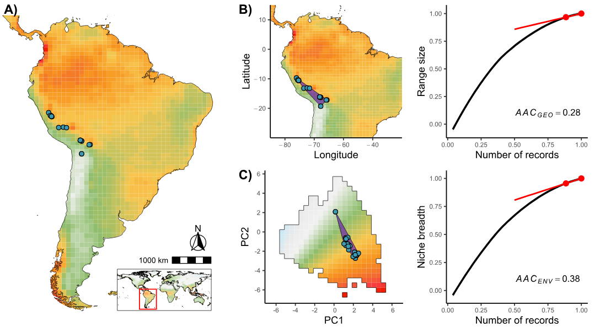
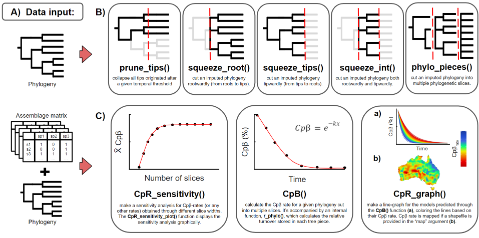
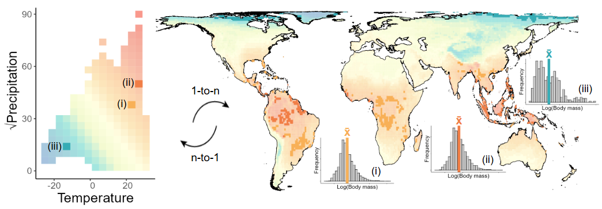

### 1. Uncertainty in biodiversity data
My research in this area develops methods to quantify uncertainty in biodiversity data (or its shortfalls), evaluate their general patterns, and identify the main factors influencing them. Rather than focusing on specific taxa, I address general questions and challenges that can be widely applied across the field, spanning different levels of biological organization and allowing replication by the broader scientific community. I believe my main contributions have been: (i) providing tools that allow users to estimate how reliable species range or niche estimates are given the currently available information (***Araujo et al., under review***); (ii) incorporating missing species information into molecular phylogenies to enable evolutionary analyses (***Araujo et al., in prep***); (iii) demonstrating how combining different biodiversity databases can improve our knowledge of species ([Araujo et al., 2022](https://doi.org/10.1007/s10531-022-02458-x); ***supervisioned Ibiapina et al., under review***); and (iv) showing how our biological knowledge is biased by socioeconomic factors ([Araujo & Ramos, 2021](https://doi.org/10.1016/j.foreco.2021.119544)).

  

Figure 1: This figure illustrates the framework used to estimate uncertainty from (A) species occurrence records when mapping (B) geographical ranges and (C) environmental niches (the manuscript where this methodology is developed is currently under review).

### 2. Biodiversity patterns in macroecology
Having spent my master's degree in an ecology and evolution department, my research during this period shifted toward the theoretical aspects of biodiversity at macroecological scales. Specifically, I focused on the evolutionary aspects of biodiversity patterns, developing methods to identify these patterns and investigating factors influencing them. My main contributions were: (i) showing that cradles (i.e., regions generating recent lineages) and museums of biodiversity (i.e., regions preserving old lineages) do not represent a simple dichotomy but rather an evolutionary gradient ([Araujo et al., 2024a](https://doi.org/10.1111/geb.13914)); (ii) making our newly developed methods reproducible and accessible to the research community through an R package designed to investigate phylogenetic patterns through time ([Araujo et al., 2024b](https://doi.org/10.1111/ecog.07364); (iii) demonstrating that speciation rates are influenced by ecological limits (carrying capacity) and niche dynamics (***Araujo et al., under review***); and by (iv) simulating how speciation and dispersal dynamics can generate patterns of phylogenetic structure ([Araujo et al., 2025](https://doi.org/10.1111/jbi.70005)).

  

Figure 2: Functions available in the R package [treesliceR](https://araujomat.github.io/treesliceR/), which are more thoroughly described in its original publication [here](https://doi.org/10.1111/ecog.07364).

### 3. Macroecology in environmental space
During my PhD, alongside my continuous interest in uncertainty, I had the opportunity to be part of a research group reinvestigating biodiversity patterns within an environmental space framework (see [Graham et al., 2025](https://doi.org/10.1111/ele.70008) and [Coelho et al., 2025](https://doi.org/10.1126/science.adu2590)). Currently, I'm leading two manuscripts that investigate body size patterns and niche conservatism for tetrapods in environmental space, both ***in preparation***.

  

Figure 3: Hutchison's duallity between geographical and environmental space to obtain body size patterns. More details on the framework can be found [here](https://doi.org/10.1111/ele.70008).
